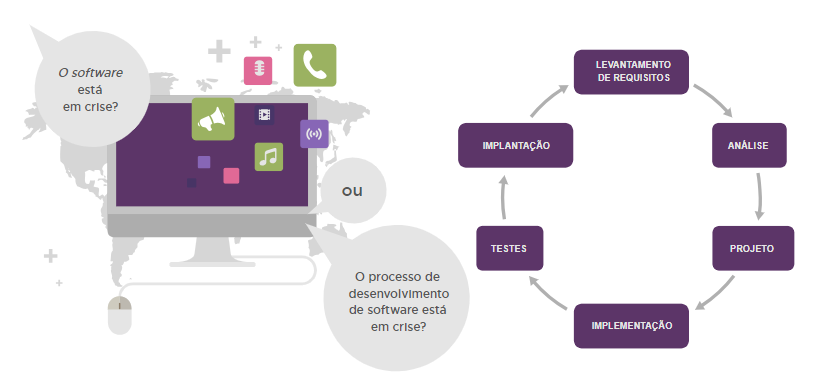
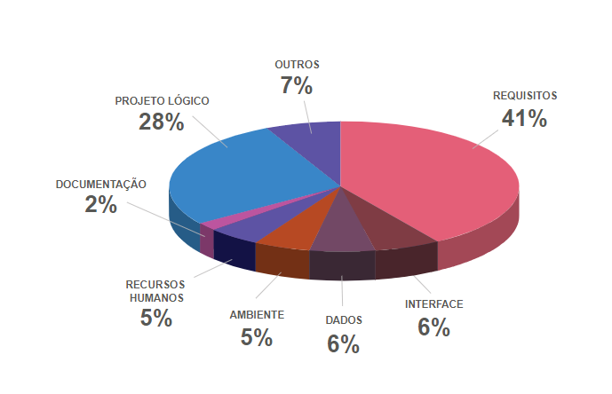
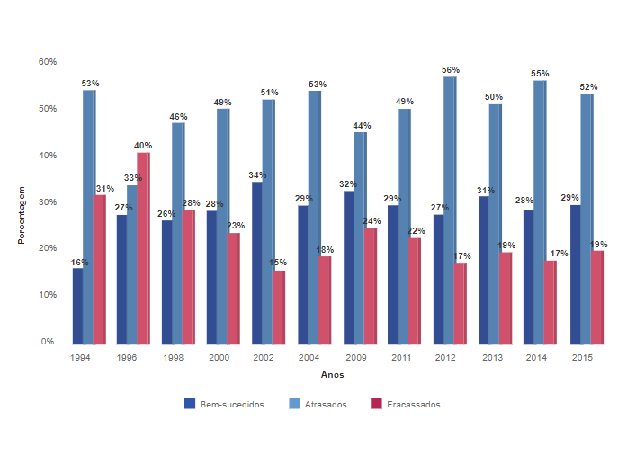
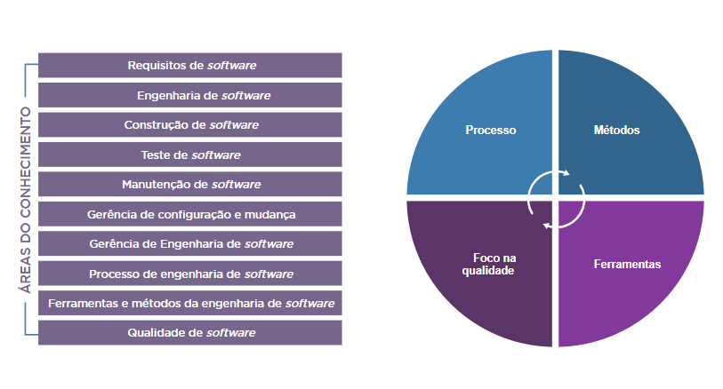
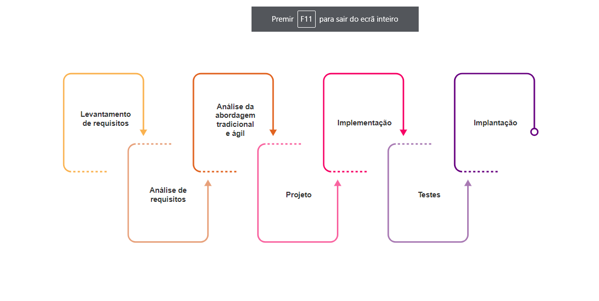

(<a href="../../README.md">readme</a>)

<h1 align=center>CAPÍTULO 2</h1>
<h2 align=center>Primeiros Passos Técnicos da Imersão em Engenharia de Software</h2>

Markdown utilizado para tirar notas dos conteúdos **escritos**.

---

## 📌 Introdução

Devido à crescente demanda por **desenvolvimento de *software***, as **indústrias de *softwares*** precisam engajar nessa onda de competitividade, melhorando de maneira eficar sua produtividade a fim de enfrentar essa realidade em constante evolução.

Durante as fases de desenvolvimento do *software*, ao combinar os métodos, as melhores ferramentas para automatizar esses métodos, as técnicas para a garantia da qualidade do *software* e os procedimentos de controle e gestão, é possível aplicar as boas práticas sugeridas pela **engenharia de *software***.

>**VIDEO - *Introdução à Engenharia de Software* ([Anotações](Cap2Videos.md#➡️-introdução-à-engenharia-de-software))**

---

<h2 align=center>IMERSÃO EM ENGENHARIA DE SOFTWARE</h2>

## ➡️ Conceitos

>**VIDEO - *Com vocês... O Software!* ([Anotações](Cap2Videos.md#➡️-com-vocês-o-software))**

#### *DEFINIÇÃO DE* **SOFTWARE**

>Software é um subsistema de um sistema computacional. São programas de computadores.

Muitos entendem *software* como um programa de computador, escrito numa linguagem específica a fim de produzir a função e o desempenho esperados.

>Software é um conjunto composto de instruções de computador, estruturas de dados e documentos.

#### *DEFINIÇÃO DE* **SISTEMA**

Sistema é um conjunto de informações e procedimentos que interagem entre si para que os objetivos sejam alcançados

#### *DEFINIÇÃO DE* **ENGENHARIA**

>Engenharia é a arte das contruções, com base no conhecimento científico e empírico. Arte adequada ao atendimento das necessidades humanas.

A engenharia representa uma metodologia unida ao esforço para empreender resultados. Esses resultados são provenientes de trabalhos focados em diversas áreas, nas quais se possui um amplo conhecimento a fim de propor soluções às necessidades.

#### *DEFINIÇÃO DE* **ENGENHARUA DE SOFTWARE**

A engenhraria de *software* envolve um conjunto de tarefas que se iniciam no momento que são registradas as necessidades das partes interessadas e terminamno momento em que o software deixa de ser utilizado por seus usuários.

>É necessário o estabelecimento e uso de sólidos princípios de engenharia para que se possa obter economicamente um *software*  que seja confiável e que funcione eficientemente em máquinas reais.

O crescimento da competição no mercado e o desenvolvimento da inteligência computacional das máquinas ocasionaram demanda por *softwares* cada vez mais complexos. O surgimento de tais sistemas resultou na necessidade de reavaliação na forma de desenvolver *softwares*.

>Engenharia de software é uma engenharia que se ocupa de todos os aspectos da produção de software.

A engenharia de software consiste num conjunto de métodos, ferramentas e procedimentos que têm por objetivo o desenvolvimento do *software* com qualidade, agregando valor ao seu empreendimento e atendendo ás necessidades ou expectativas dos *stakeholders*.

A engenharia de *software* aplica práticas existentes em algumas áreas da engenharia, tais como:

- Desenvolvimento de *softwares* com qualidade
- Trabalho em equipe
- Gerenciamento do processo de desenvolvimento
- Custos e prazos admissíveis

(<a href="#readme-top">back to top</a>)

---

## ➡️ Evolução do Hardware e do Software

>**VIDEO - *Evolução de Software e Hardware* ([Anotações](Cap2Videos.md#➡️-evolução-de-software-e-hardware))**

O contexto em qu eo software foi desenvolvido está ligado a várias décadas de evolução dos *hardwares*. O melhor desempenho do *hardware* e o custo mais baixo aceleraram o aparecimento de sistemas de *software*.

Os autores Velloso(2014) e Pati(2016) comentam sobre a evolução dos *hardwares* e dos *softwares*. Ela está relacionada ao aprendizado contínuo de novas competências e habilidades ao longo do tempo.

> Até o início do século XVIII, não se diferenciava com clareza o que era *hardware* ou *software*, pois os equipamentos eram basicamente eletromecânicos.

(<a href="#readme-top">back to top</a>)

---

## ➡️ Principais Tipos de Software

A partir do contexto hitórico da evolução do *hardware* e do *software*, foram construídos os alicerces do funcionamento do *software*

### TIPOS DE SOFTWARE

>**VIDEO - *Tipos de Software* ([Anotações](Cap2Videos.md#➡️-tipos-de-software))**

#### 🔷 SISTEMA

**Software de Sistema**

É o conjunto de instruções que transformam o hardware num sistema com o qual o usuário pode interagir e fazer funcionar os seus programas. Ex: MAC, Linux, Windows

#### 🔷 APLICATIVO

**Software de Aplicativo**

São programas que permitem aos usuários executar determinadas tarefas. Exemplos: Word, Paint, Excel e calculadora.

#### 🔷 SERVIÇO

**Software de Serviço**

É um modelo de compartilhamento de software, no qual é liberado apenas o acesso ao serviço oferecido, licenciado para uso por meio da internet. Não é vendido nem instalado localmente. Exemplos: Google Docs e PDF Converter.

#### 🔷 GESTÃO

**Software de Gestão**

Auxilia na gestão empresarial, tem como objetivo otimizar a rotina da empresa, fornecendo uma informatização inteligente dos processos, como controle financeiro, compras e estoque. Exemplo: ERP.

#### 🔷 LIVRE

**Software de Livre**

Está disponível e é distribuído livremente. Pode ser executado, adaptado, modificado e redistribuído de acordo com a necessidade de cada usuário. Ao redistribuir a nova versão, pode ser gratuito ou não.

#### 🔷 ABERTO

**Software de Aberto**

É um software cujo código é acessível a qualquer pessoa. Pode ser executado, modificado, estudado e distribuído gratuitamente. Sua filosofia é voltada para a colaboração entre usuários.

#### 🔷 PROPRIETÁRIO

**Software de Proprietário**

Pertence a um fabricante, que detém seus direitos de uso, edição e redistribuição. O usuário deve pagar por uma licença e só pode utilizar o <i>software</i> em um contexto restrito. Exemplo: Office, Photoshop e Winzip.

(<a href="#readme-top">back to top</a>)

---

## ➡️ Crises do Software

>*A crise é pertinente ao software ou ao processo de desenvolvimento de software?*

O estudo mostra que não há crise no desenvolvimento de *software*, pois o crescimento da competição e da inteligência computacional dos *hardwares* resultou na demanda por sistemas de *software* cada vez mais complexos, que tirem proveito de tais capacidades.

Falhas são encontradas com frequência, há uma probabilidade de elas terem sido introduzidas durante a especificação de requistos e passarem dispercebidas durante o desenvolvimento e os testes de *software*.

Um componente **fundamental** do desenvolvimento de *software* é a qualidade da comunicação entre os clientes e a equipe de desenvolvimento. Caso ela falhe, o sistema também falhará.

Para entender e avaliar a origem das falhas em projetos de desenvolvimento de *software*, foram efetuados estudos e pesquisas, entre elas, o do **Departamento de Defesa dos Estados Unidos (DOD)** e os do **Standih Group**.

>*O estudo efetuado pelo **DOD** na **década de 1990** indicou que **75%** de todos os grandes sistemas de softwares desenvolvidos falham, e a principal causa disso é a falta de gerenciamento adequado por parte do desenvolvedor e do cliente, e não em razão do desempenho técnico. **- SOTILLE, 2014***

A principal fonte de erros no ciclo de vida de um software é a fase de identificação dos problemas, conhecida como **análise de requisitos**.

O **Standish Group** foi um marco na história dos estudos de falhas de projetos de sistemas de *software*, responsável pela ublicação dos relatórios **Chaos**, desde **1994**.

De acordo com o **Standish Group** (2009), as principais causas de falhas nos projetos estão associadas a dificuldades com os seguintes temas:

- Ausência de apoio da alta gerência
- Comportamento ao trabalhar em grupo
- Envolvimento superficial do usuário
- Inexperiência do gerente de projeto
- Falta de equipe qualificada
- Dúvidas relacionadas às regras de negócio e escopo do projeto

Algumas possíveis causas da crise do *software*:

- Alteração nos requistos
- Mudanças nas legislações, normas ou processos aos quais a empresa esteja subordinada
- Metodologia de desenvolvimento

É possível que as alterações impostas gerem a necessidade de se executarem mudanças no cronograma e no custo previsto para o desenvolvimento do *softwre*. Muitos projetos de *software* nascem com o cronograma estabelecido antes mesmo de os principais requisots serem definidos.

>**VIDEO - *Falhas Acontecem. Como Evitá-las* ([Anotações](Cap2Videos.md#➡️-falhas-acontecem-como-evitá-las))**

(<a href="#readme-top">back to top</a>)

---

## ➡️ Origem da Engenharia de Software

De acordo com Swebok (2004), o termo "engenharia de software" foi cirado na década de 1960 e utilizado oficialmente em 1968 na Conferência sobre Engenharia de *Software* da Otan. Sua origem está relacionada a uma tentativa de contornar a crise do *software*, com a finalidade de dar um treinamento sistemático e controlado ao desenvolvimento de sistemas de *software* complexos.

**Origem da engenharia de *software***

- **1960**: Surgiu o termo engenharia de *software*
- **1968**: Oficializou-se o conceito de engenharia de *software*
- **1972**: Conferência da Otan apresentou um relatório sobre engenharia de *software*
- **1976**: Foi criada uyma comissão para dar origem aos padrões de engenharia de *software*
- **1979**: Inicia-se o padrão **IEEE 730** para uniformizar a preparação e o conteúdo da engenharia de *software*
- **1990**: o **IEEE 1.074**, padrão internacional sobre os assuntos relacionados ao processo de desenvolvimento de software, é instaurado.
- **1995**: Cria-se a **SO/IEC 12.207** com o título de padrão para os processos e ciclo de vida do sofftware.

A **IEEE Computer Society** aprova a elaboração do **Swebok**, guia para ser a principal referência da engenharia de software.

Em **1972** a **IEEE Computer Society** publica, pela primeira vez, seu relatório sobre engenharia de *software*

Em **1976** é fundada uma comissão dentro da **IEEE Computer Society** com a responsabilidade de desenvolver padrões de engenharia de *software*. A primeira norma foi o padrão **IEEE 730**, cujo objetivo era fornecer requisitos mínimos de uniformidade para a preparação e o conteúdo do planejamento de *software*, que foi concluído em **1979**.

No período de **1981** a **1985**, surgiu a **IEEE 1.002**, padrão de taxonomia que descreve a forma e o conteúdo dos princípios de engenharia de *software*.

Em **1990** foi inciado o planejamento para um padrão internacional focado em conciliar os pontos de vista do processo de *software* por meio da **IEEE 1.074**. Esse padrão foi finalizado em **1995**, com a designação da **ISO/IEC 12.207**, cujo título é: **padrão para os processos do ciclo de vida do *software***

Por meio da **ISO/IEC 12.207**, o conselho de tutores da **IEEE Computer Society** aprovou a proposta apresentada em 1993 para a elaboração do **Swebok**, guia criado pelo **Institute of Electrical and Electronics Engineers (IEEE)**, conhecida como entidade de especificação de padrões, para ser a principal referência à engenharia de *software*

#### 🔷 20001

Um manifesto foi publicado, quando **Kent Beck** e dezesseis outros notáveis desenvolvedores, produtores e consumidores de *software*, conhecidos como **Aliança Ágil**, assinaram o **Manifesto para o Desenvolvimento Ágil de *Software*** cujo objetivo era apontar novas direções na execução de projetos.

Os frameworks de gerenciamento de projetos ágeis surgiram em função da criação de processos de desenvolvimento ágeis, como o **Extreme Programming (XP)**. O objetivo é adequar a gestã aos principios ágeis de construção, tais como:

- Cliente participativo e colaborativo
- Mudanças frequentes
- Entregas constantes

A base para a elaboração desse manifesto considera que os requistos não são estáveis durante todo o projeto, e as mudanças ocorrerão em qualquer cenário, por isso as execuções sequenciais das fases de um projeto não são tão previsíveis como gostaríamos que fossem. Isso posto, ficam definidos quatro fundamentos básicos que guiam o manifesto:

**- Indivíduos e interações, em vez de processos e ferramentas**
**- Software funcionando, em vez de doscumentação abrangente**
**- Colaboração do cliente, em vez de negociação de contratos**
**- Resposta às modificações, em vez de seguir um plano**

Esses fundamentos são a base de todos os frameworks ágeis, estabelecendo o alicerce sobre o qual são desenvolvidos os padrões de agilidade:

- Foco no time
- Cliente fazendo parte do projeto
- Entregas durante o ciclo de projeto e mudanças são bem-vindas em qualqer momento do projeto

>**VIDEO - *O Guarda-Chuva da Engenharia de Software* ([Anotações](Cap2Videos.md#➡️-o-guarda-chuva-da-engenharia-de-software))**

(<a href="#readme-top">back to top</a>)

---

## ➡️ Áreas de Conhecimento da Engenharia de Software

o **Swebok** (2004) organizou dez áreas de conhecimento com o objetivo de estabelecer um limite para a engenharia de *software*

Independente da área de conhecimento, a engenharia de software tem elementos fundamentais, tais comos:

- Métodos
- Ferramentas
- Processos

**Processos** representam as ações realizadas, ou seja, a aplicação de métodos e ferramentas para se obter um resultado específico e definem a sequência de métodos que serão executados bem cmo quais ferramentas serão disponibilizadas.

**Métodos** podem ser entendidos como maneiras de fazer, quais roteiros serão seguidos para a realização de determinadas tarefas. Exemplos:

- Atividades de planejamento
- Levantamento de requisitos
- Design
- Definição da arquitetura de *software*
- Execução dos testes

**Ferramentas** representam o meio automatizado para a realização das taredas e permitem que as atividades sejam executadas de forma mais eficiente e eficaz. Exemplo: *software* de modelagem de dados ou *softwares* para a implementação do *software*.

A equipe envolvida no desenvolvimento do sistema de *software* utiliza ferramentas, métodos e processos com o objetico de melhorar a qualidade dos produtos de *software*.

(<a href="#readme-top">back to top</a>)

---

## ➡️ Desafios Encontrados pela Engenharia de Software

No desenvolvimento de *software*, em geral, encontram-se problemas do tipo:

- Recursos destinados aos projetos tornam-se insuficientes.
- Custos dos produtos são altos.
- Soluções propostas naõ agradam às partes interessadas.
- Custos dos *softwares* são maiores que o custo do *hardware*
- Manter um *software* custa mais que desenvolvê-lo

Consequentemente, a engenharia de *software* foca na missão de superar os desafios:

- Reduzir custo
- Seguir o cronograma de acordo com as expectativas.
- Melhorar a qualidade do *software*
- Documentar. Todos os detalhes devem ser escritos, de modo que qualquer parte interessada possa entender.
- Adaptar as alterações sugeridas e/ou necessárias no tempo e no custo adequados.
- Atender às necessidades do cliente.
- Nortear o desenvolvimento do sistema de *software* de acordo com as mudanças tecnológicas.

>**VIDEO - *Desafios do Design de Software* ([Anotações](Cap2Videos.md#➡️-desafios-do-design-de-software))**

Conforme **Pressman** (2009), todo *software* é construído com base em um modelo de processo, também conhecido como ciclo de vida. O ciclo de vida de um *software* compreende um conjunto de etapas que envolvem **métodos**, **ferramentas** e **procedimentos** para a obtenção do produto ou serviço de *software* desejado.

Se de um lado, o **método tradicional** é centrado em um processo sequencial e dirigido à qualidade dos artefatos, do outro, o **método ágil** tem foco na rapidez de adequação às mudanças e conta com elementos como:

- Cliente integrado à equipe.
- Prazos curtos de desenvolvimento.

O método de gerenciamento de projetos **tradicional** é criticado por sua falta de flexibilidade em se adaptar a essa nova realidade, enquanto o gerenciamento ágil vem ganhando popularidade justamente por sua capacidade de adequação às situações voláteis do ambiente. Porém, também recebe críticas pelo grau de informalidade implícita em seu processo.

No **manifesto ágil** considera-se que os requisitos não são estáveis durante todo o projeto, que as mudanças vão ocorrer em qualquer cenário e que as execuções sequenciais das fases não são tão previsíveis como gostaríamos que fossem.

A base de todos os **frameworks ágeis** é composta de:

- Foco no time
- Cliente fazendo parte do projeto
- Entregas durante o ciclo do projeto
- Mudanças bem-vindas em qualquer momento do projeto

(<a href="#readme-top">back to top</a>)
