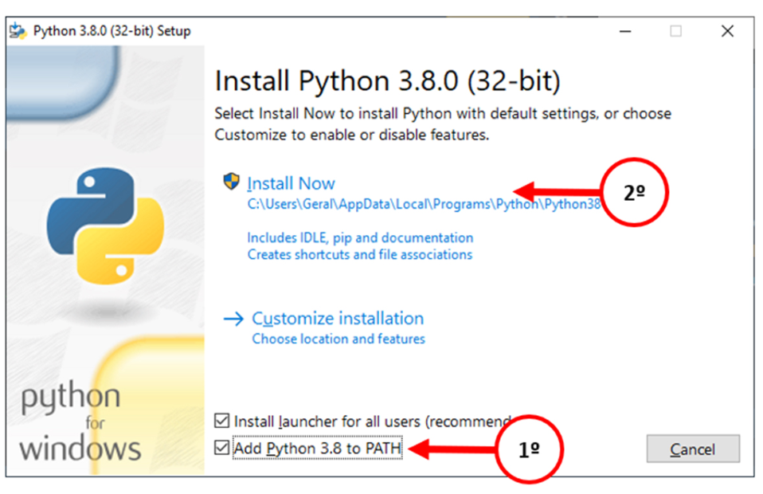
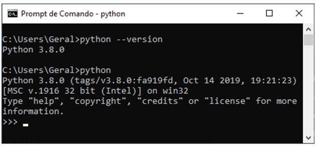
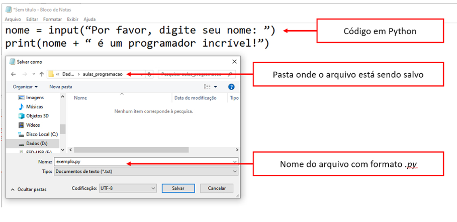

(<a href="../../README.md">readme</a>)

  <h1 align=center>CAPÍTULO 6</h1>

<h2 align=center>Primeiros Passos de Utilização de Algoritmos e Fluxogramas</h2>
   
Markdown utilizado para tirar notas de aulas e de conteúdos.

## 🟢 Que negócio é esse de Programação?

Amada por muitos, temida por outros e ignorada por boa parte dos usuários comuns, a programação é uma das áreas de maior importância para atecnologia como a conhecemos hoje!

### A Famosa Palavra "Algoritmo"

O que é o Algoritmo?
>É uma sequência de passos em ordem lógica que objetiva resolver um problema

O que é um Bug?
>É uma falha ou um passo que não foi concluído com êxito ou travou

Pode-se dizer que Algoritmo é uma sequência ordenada de instruções que visa resolver um determinado problema.

### Todo Algoritmo é um Programa de Computador?

Podemos usar os computadores para criar programas que realizemas instruções de um algoritmo, mas existem muitas formas de representar essa sequência passo a passo!

Na *computação*, duas das formas mais comuns de representação algorítmica são os *fluxogramas* (também conhecidos como diagramas de blocos) e os *pseudocódigos* (que podem ter diferentes versões, como o Portugol).

A representação através de um *fluxograma* cont´m uma sequência de blocos geométricos indicando a ordem em que os eventos ocorrerão.  Já a representação através de *pseudocógdigo* é feita através de texto, com uma linguagem que não é uma linguagem de programaçãp, mas que apresenta uma estrutura formal.

Fluxograma:

Algoritmo:

~~~
algoritmo "Soma"
variáveis
    valor1, valor2, resultado: inteiro
início
    Escreva "Digite o primeiro valor"
    Leia valor1
    Escreva "Digite o segundo valor"
    Leia valor2
    resultado = valor1 + valor2
    Escreva resultado
Fim
~~~

Pode-se observar um mesmo algoritmo representado em duas formas distintas (*fluxograma* e *pseudocódigo*) e nenhum programa de computador foi escrito até esse momento.

Esse mesmo algoritmo pode ser *implementado* usando uma linguagem de programação qualquer, como **Python**, **Java**, **C++**, **PHP**, etc.

~~~python
valor1 = input("Digite o primeiro valor ")
valor2 = input("Digite o segundo valor ")
resultado = int(valor1) + int(valor2)
print(resultado)
~~~

(<a href="#readme-top">back to top</a>)

## 🟢 Aprendendo com a Mão na Massa!

Uma das melhores formas de aprender algo é colocando a mão na massa, não é mesmo?

## 🟢 Etapa 1 - Instalando Python

    
Instalação

1. Instalar Python ([site](https://www.python.org))

Após realizar o download da última versão, execute o instalador e ficar atento à opção de "adicionar ao path"

Para saber se tudo correu bem, basta abrir o terminal e inserir

~~~sh
python --version
~~~

(<a href="#readme-top">back to top</a>)

## 🟢 Etapa 2 - Conhecendo Alguns Comandos

Toda linguagem de programação possui algumas palavras reservadas, que são palavreas que têm algum significado dentro daquela linguagem de programação. Essas palavras reservadas podem ser comandos, por exmplo, que realizam tarefas específicas.

para exibir uma mensaem na tela do computador, usaremos o comando ***print()***. A sintraxe desse comando nos obrifa a fornecer, entre parênteses, o texto que queremos exibir na tela.

## 🟢 Tipos de Formatações do Print

Há algumas maneiras de formatar o *print()*.

Vamos fazer os tipos de formatação de print a partir destas informações:

~~~python
"""
inteiro = int
real = float
texto = str
logica = bool
"""
valor1 = 875.56
valor2 = 45.1
valor3 = 34955.95847
~~~

---

### **Forma "raiz"**

Formatando incluindo **vírgula** entre as **str**

>Forma "raiz" pois uma grande maioria das linguagens de programação conseguem fazer esse tipo de formatação

~~~python
print("Valor 1 = ", valor1, "\nValor 2 = ", valor2,"\nValor 3 = ", valor3)
~~~

---

### **Formato format()**

Vai pegar o primeiro **par de chaves** e alocar com o primeiro **valor passado**, e assim por diante

**:10.2f** -> Seta como padrão 10 dígitos (8 para inteiros e 2 casas decimais)

~~~python
print("Valor 1 = {:10.2f}\nValor 2 = {:10.2f}\nValor 3 = {:10.2f}".format(valor1, valor2, valor3))
~~~

***TEM QUE CONTINUAR, PAREI NO MEIO DO VÍDEO***

## 🟢 Variável

### Dados - Tipos e instrução de Saída

***VER O VÍDEO***

### Variáveis de Memória e Casting

***VER O VÍDEO***

### Interpretador Python

Para abrir o prompt de comando do python, basta digitar *python* no terminal

Com o interpretador do Python em execução, tudo o que digitarmos nessa linguagem será imediatamente interpretado e executado após teclar **ENTER**. Vamos tentar executar o seguinte comando, pressionando **ENTER** ao final

~~~python
print("Olá, mundo!")
~~~

Se tudo correu bem, após teclar **ENTER**, a mensagem "Olá, mundo!" deve ter sido exibida na tela.

Variável é um espaço que um programa pode reservar na memória *RAM* do computador para armazenar temporariamente alguns dados, como algo que o usuário tenha digitado ou o resultado de um cálculo.

Algumas linguagens de programação possuem comandos específicos para criação de variáveis, mas a linguagem **Python** entende que uma palavra que seja escrita ao lado esquerdo do sinal de **=** (igual) é uma variável e cria automaticamente caso seja seu primeiro uso. Então se escrevermos os comandos a seguir (lembrando de teclar ENTER ao final de cada linha), criaremos uma variável com o nome do usuário e exibiremos na tela:

~~~python
nome = "Kevin Mitnick"
print(nome + "é um programador incrível!")
~~~

Infelizmente, o código não está recebendo o nome do usuário, apenas exibindo um nome fixo. Para permitir aos usuários digitarem informações dentro de variáveis, devemos utilizar o comando ***input()***

Em sua sintaxe, o comando ***input()*** exige a presença de uma variavel antes do comando e de uma mensagem de texto entre parênteses: ***nome_da_variavel = input("Mensagem de texto:")***

Reescrevendo o programa anterior para aceitar que o usuário digite seu próprio nome, teremos o seguinte:

~~~python
nome = input("Por favor, digite seu  nome:")
print(nome + "é um programador incrível")
~~~

Para sair do interpretador do Python, basta escrever ***exit()*** e teclar *ENTER*

Agora vamos reunir todas as linhas do nosso programa em um só arquivo, qu damos o nome de ***script***. Para fazer isso, basta abrir o Notepad. No editor de texto aberto, digite o código do programa e salve em formato **.py**

Uma vez que o arquivo que contém uma série de comandos em Python, podemos executas esse script diretamente do terminal.

Para executar um arquivo Python, basta escrever:

~~~sh
python nome_do_arquivo.py
~~~

(<a href="#readme-top">back to top</a>)

## 🟢 Etapa 3- Esqueça a Tela Preta!

(<a href="#readme-top">back to top</a>)