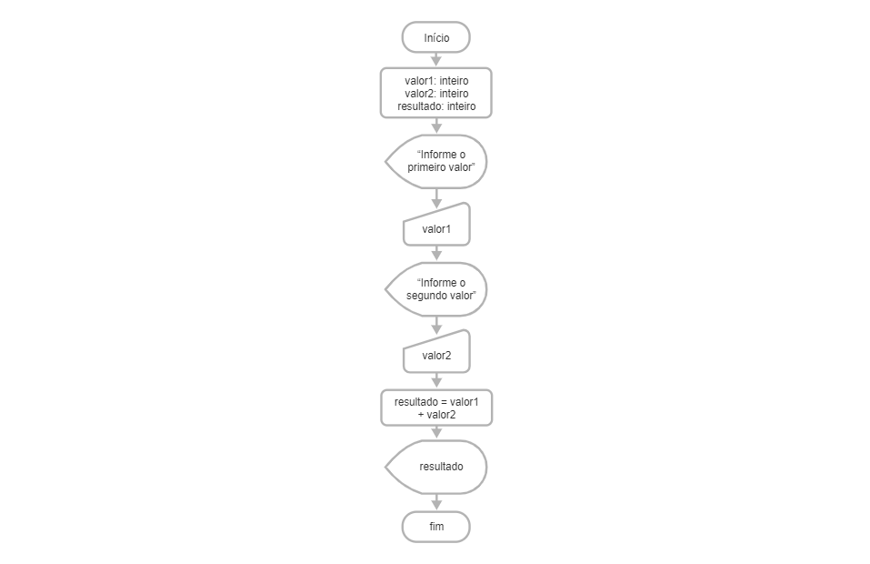

(<a href="../../README.md">readme</a>)

  <h1 align=center>CAPÍTULO 6</h1>

<h2 align=center>Primeiros Passos de Utilização de Algoritmos e Fluxogramas</h2>
   
Markdown utilizado para tirar notas de aulas e de conteúdos.

## 🟢 Que negócio é esse de Programação?

Amada por muitos, temida por outros e ignorada por boa parte dos usuários comuns, a programação é uma das áreas de maior importância para atecnologia como a conhecemos hoje!

### A Famosa Palavra "Algoritmo"

O que é o Algoritmo?
>É uma sequência de passos em ordem lógica que objetiva resolver um problema

O que é um Bug?
>É uma falha ou um passo que não foi concluído com êxito ou travou

Pode-se dizer que Algoritmo é uma sequência ordenada de instruções que visa resolver um determinado problema.

### Todo Algoritmo é um Programa de Computador?

Podemos usar os computadores para criar programas que realizemas instruções de um algoritmo, mas existem muitas formas de representar essa sequência passo a passo!

Na *computação*, duas das formas mais comuns de representação algorítmica são os *fluxogramas* (também conhecidos como diagramas de blocos) e os *pseudocódigos* (que podem ter diferentes versões, como o Portugol).

A representação através de um *fluxograma* cont´m uma sequência de blocos geométricos indicando a ordem em que os eventos ocorrerão.  Já a representação através de *pseudocógdigo* é feita através de texto, com uma linguagem que não é uma linguagem de programaçãp, mas que apresenta uma estrutura formal.

(<a href="#readme-top">back to top</a>)

## 🟢